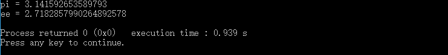
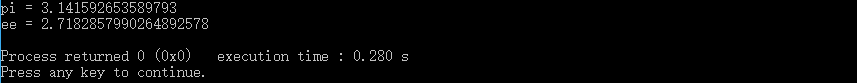

常见的字符串与数字之间的转换

1. 平台有关

   itoa()、atoi()、atol()、atof()等函数，属于C语言函数，但需要注意的是，这些函数不属于标准C内容，跟平台相关，通用性、可移植性较差，在部分开发环境或平台上无法使用。

2. 平台无关

   数字---->字符串   C语言: sprintf()函数    C++: ostringstream    C++11: to_string()函数

   字符串---->数字   C语言: sscanf()函数    C++: istringstream      C++11: stoi()、stol()、stoll()[字符串转long long类型]、stoull()[转unsigned long long]、stof()[转float]、stod()[转double]、stold()[转long double]

3. 示例

   对于sprintf()和sscanf()之外的函数，几乎输入参数是要转换的内容，输出是转换后的结果，使用十分简单。在此只对使用相对比较复杂的sprintf和sccanf函数进行举例，对于C++流的方式，也进行简单介绍。

   ```c++
   #include <iostream>
   #include <iomanip>
   #include <cstdio>
   using namespace std;

   int main()
   {
       double PI = 3.141592653589793;
       char pi[100];
       sprintf(pi, "%.16f",PI);//需要指定小数点后面位数，否则默认为小数点后6个有效数字,转换结果在pi中
       cout << setprecision(20)<<"pi = "<<pi<<endl;

       char e[] = "2.718285687";
       float ee;
       sscanf(e, "%f", &ee);//float对应为"%f"，double对应为"%lf"，转换结果保存在变量ee中
       cout << setprecision(20)<<"ee = "<<ee<<endl;
       return 0;
   }
   ```

   上面代码在codeblocks + MinGW上运行的结果是

   

   需要注意的是，整数形式的转换能够得到完全一致的结果，由于众所周知的浮点数精度问题，所以在进行浮点数转换时，存在不完全一致的结果。另外，sprintf函数输出结果是第一个参数，sscanf函数的输出结果是第二个参数右边的参数(可变参数的原因)，所以两个函数的第二个参数(格式控制字符串)使用有所差异。具体表现为，sprintf函数需要如上述程序示例那样，在转换时指定小数点位数；而sscanf函数需要指定的是与输出结果变量类型相一致的控制符。底层的原因是函数参数都是从右往左压栈，但是两个函数的输出结果的参数位置不一致导致。

   下面的例子展示了使用ostringstream和istringstream进行数值类型与字符串类型之间的转换

   ```c++
   #include <iostream>
   #include <sstream>//注意包含这个头文件
   #include <iomanip>
   #include <cstdio>
   using namespace std;

   int main()
   {
       double PI = 3.141592653589793;
       ostringstream s1;//ostringstream相当于sprintf函数
       s1 << setprecision(16)<<PI;
       string s2 = s1.str();
       cout <<"pi = "<<s2<<endl;

       string e = "2.718285687";
       float ee;
       istringstream se;//istringstream相当于sscanf函数
       se.str(e);
       se >> ee;
       cout << setprecision(20)<<"ee = "<<ee<<endl;
       return 0;
   }
   ```

   输出结果为

   

   ​